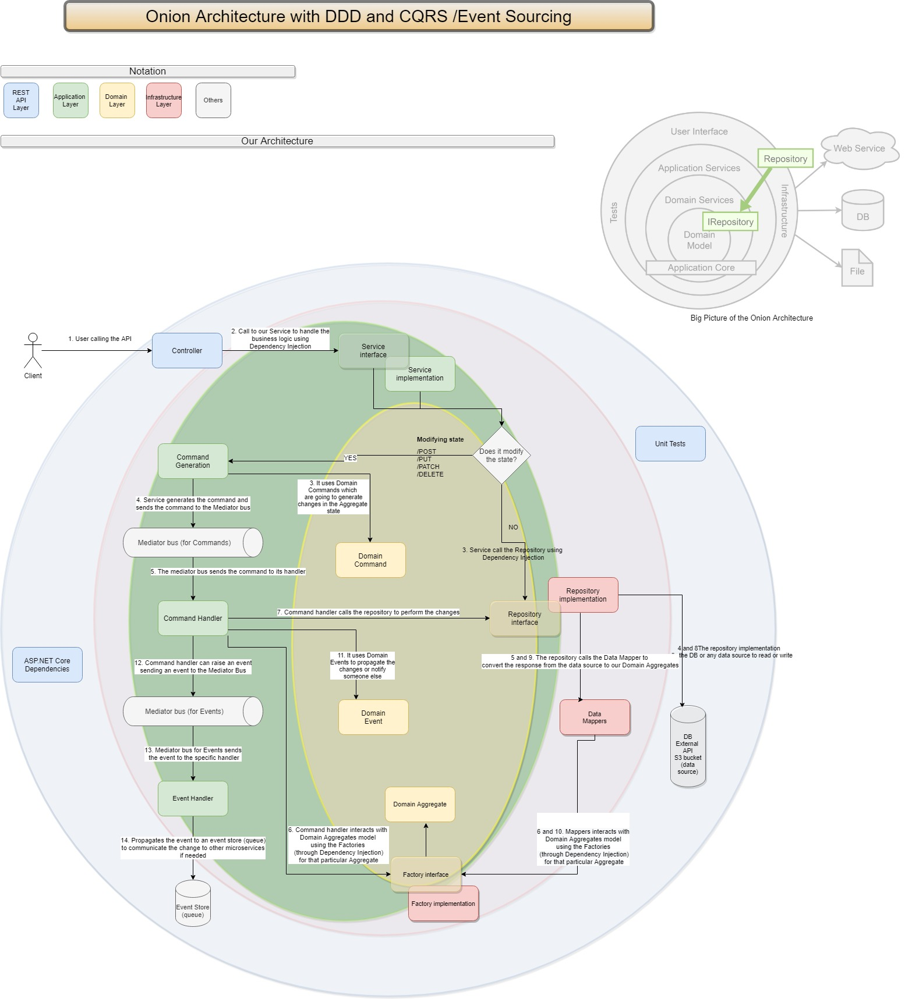

# Architecture 
This template uses the Onion Architecture, which is well-known to be used together with DDD patterns and practices.

## Quick Overview
This architecture is sharing the principles of [Hexagonal Architecture](/HEXAGONAL.md)

This architecture is called Onion Architecture because of the above diagram (it is one of the Clean Architectures when speaking about code) and it was created in 2008 by Jeffrey Palermo and it is a great fit with DDD. 

And DDD and microservices are a great fit for CQRS (Command Query Responsibility Segregation) and ES (Event Sourcing, because Microservices Architectures should be Event Driven Architectures and you want to raise Events from your microservices to communicate between them and propagate data or different information). This kind of architecture follows all the patterns, benefits and guidelines stated in the Hexagonal Architecture (also called Ports and Adapters Architecture. Any Clean Architecture must follow the principles from [Hexagonal Architecture](/HEXAGONAL.md))

## Different layers
It has three common layers:

* Application layer: where all the business logic is implemented
* Domain layer: where our domain is modeled (Task aggregate domain model for example) and some patterns about DDD are there like Repository Pattern (only interfaces, not implementation)
* Infrastructure layer: where we implement the code that needs to go outside our application, like for example data access implementation

There can be external layers which are called presentation layers or testing layers. For example in a common API the external layer is RestAPI which has the dependencies to handle APIs with ASP.NET Core but in the Scheduler we don't have APIs, so this external layer is a Console application layer which handles all that we need to start the CronJob and the definition of the workflow (all the steps like getting the feeds pending to be processed, impersonation, etc - only the definition)

## The dependency rule
The concentric circles represent different areas of software. In general, **the further in you go, the higher level the software becomes. The outer circles are mechanisms. The inner circles are policies.**

#### What does that mean?

**Nothing in an inner circle can know anything at all about something in an outer circle**. In particular, the **name of something declared in an outer circle must not be mentioned by the code in an inner circle**. That includes functions, classes. variables, or any other named software entity.

## CQRS and DI (Command Query Responsibility Segregation and Dependency Injection)

Coming back to the diagram, it starts in the controller and it is using separation of concerns and responsibilities using Dependency Injection and also CQRS to get isolated, maintainable, flexible, scalable, testable and reliable code. In any of these separated responsibilities, the code does only one thing but it is ready to be extended if needed or fully testable from unit tests and integration tests.FeedsController is in the RestAPI Layer,  which is outter one and that layer is the unique layer with dependencies with ASP.NET Core 3.1.

If in the future we want to upgrade the version, that's the only affected layer for example. Same with API routing or API serialization. That layer contains the things we need to do everything regarding API magic like JsonAPI serialization and deserialization.For example the Services are the ones responsible to have the business logic for an specific resource regarding our business rule.

For example, in Feeds API, we have the FeedsController which uses an injection of IFeedService. In that way, we "cross" the boundary between RestAPI layer and Application Layer, where we have  all the business logic that we need in Services (Service Layer Pattern) and Handlers. Then in this Service we can have two different flows.

One is for reading values (for example a GetById action) and other flow should be modifying our state (writing, updating or deleting data and changing our state). Here is where CQRS takes part. Commands are related to Events (maybe you remember this from the EventStorming team lab) and Events are related to things that have changed (Feed Created for example should be an event once the POST creates a Feed in our DynamoDB). And Queries are only to read the values, for example as I mentioned GET actions.

So, if you want your code to be reliable, free of thread locking when usage is high and with all the things ready to build your Event Driven Architecture with a lot of microservices CQRS is necessary if you want to step away from bad practices (not only in the code, as well in the main architecture with all the microservices. You need to be consistent on how to propagate data between them and also you need to be consistent on how to create Events that are related to the Domain of your enterprise application)

There are two flows here as I mentioned:

* Reading (Queries): It is going to use Dependency Injection to the Repository class that it needs to go to the Database or any kind of data source system. The definition of that repository class is an interface, a contract, inside our Domain Layer (you can see that in the upper right corner which is an image from the original post about Onion Architecture in 2008). The implementation as I mentioned before, it should be outside the Domain Layer, in fact in the Infrastructure Layer. Why? Because if you are building the Repository implementation in the domain you are coupling the domain to the data source access and also you are breaking The Dependency Rule.
* Writing (Commands): If you are modifying the Aggregate state (for example Feeds Aggregate) you need to specify that creating a Domain Command in the code to use CQRS properly. So from this point, if you want to use Domain Commands and CQRS in a way to get the best performance you just need to use a message bus. In our case we chose to use Mediator pattern which creates an internal bus and it is the one managing or handling the Domain Commands to use Handlers.
   These handlers are going to be called by a different thread any time, and if the thread pool is locked, the Domain Command is going to be in the Mediator bus waiting for a thread to be released and execute the rest of the code. This is everything C# magic and we just need to use the Mediator library to use this pattern. Once the code arrives to the specific Handler for any Command with a different thread, it is going to perform the changes in the data source (can be a database, API, etc) using the Repository pattern. But as I mentioned before using Dependency Injection to get a fully testable code following the dependency rule and SOLID principles applied in the architecture.

And in that way, if you need it, once the Handler calls the Repository to perform the changes, you may raise an event which can go to any event store (a queue) and propagate the data to other microservices consuming information from that event store. For example, a Notification microservice which sends an email or something like that.

